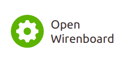
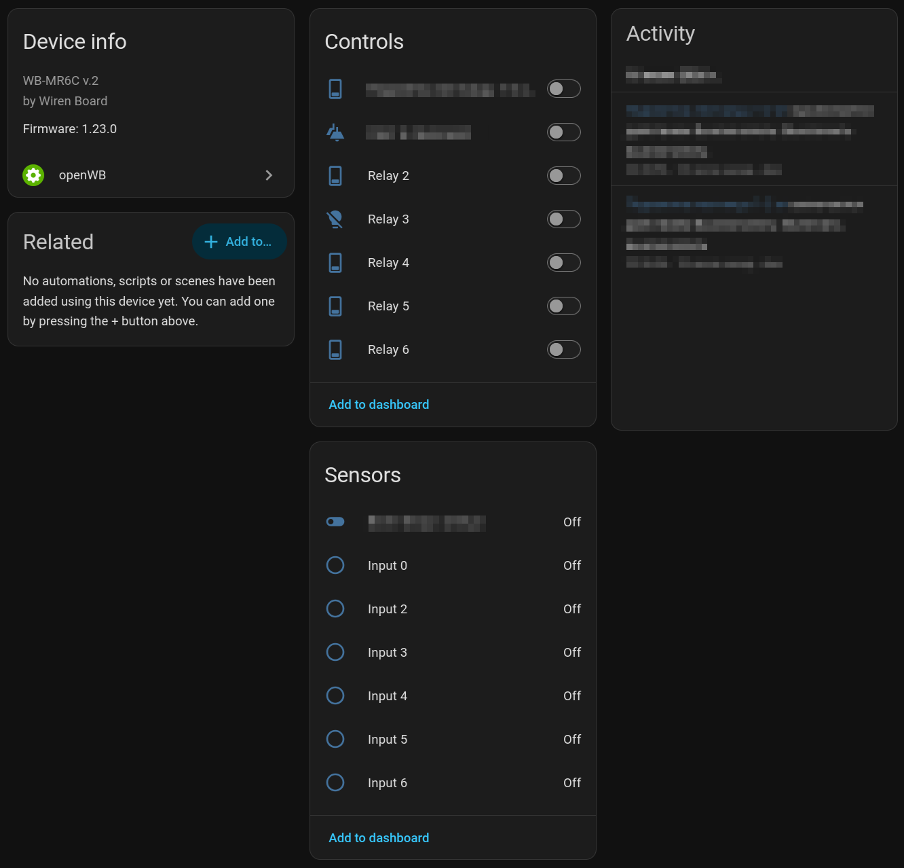

# OpenWB for Home Assistant

Open Source Home Assistant integration with wirenboard modules in HACS format.
Allow to use supported set of wirenboard modules without closed source wirenboard controller

Usually, in order to have support for wirenboard controllers in home assistant, you need to purchase an expensive controller running Linux. 
This controller is controlled from homeasstant via the MQTT protocol, and it itself transmits commands to the end devices via the modbus protocol.

However, if you already have a device capable of running Linux (for example Raspberry PI) with homeassistant installed on it, you can communicate with devices via the modbus protocol directly using this module

## Status

Not support fast modbus yet

Supported modules:

- WB-MR6C v.2
- WB-MR6CU v.2
- WB-MCM8

## Modbus Documentation

- [WB-MR6CU v.2](https://wiki.wirenboard.com/wiki/WB-MR6CU_v.2_Modbus_Relay_Modules)
- [WB-MCM8](https://wiki.wirenboard.com/wiki/WB-MCM8_Modbus_Count_Inputs)
- [WB-MCM8 registers](https://wiki.wirenboard.com/wiki/MCM8_Registers)
- [Relay Module Modbus Management](https://wiki.wirenboard.com/wiki/Relay_Module_Modbus_Management)
- [I/O Mapping Matrix](https://wiki.wirenboard.com/wiki/I/O_Mapping_Matrix)

## Installation with HACS

1. In Home Assistant, open HACS.
2. Open the three-dot menu and choose **Custom repositories**.
3. Add this repository URL and select **Integration** as the category.
4. Install **openWB** from HACS.
5. Restart Home Assistant.
6. Go to **Settings** -> **Devices & services** -> **Add integration** and search for **openWB**.

## Development Installation

Copy `custom_components/openwb` into your Home Assistant `custom_components` directory and restart Home Assistant:

```text
config/
  custom_components/
    openwb/
```

After copying the integration, use the step-by-step testing guide:

- [Testing after custom_components installation](docs/testing.md)

Backend architecture:

- [Backend design](docs/backend-design.md)

## Screenshots


